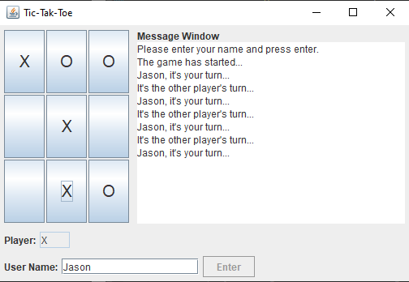
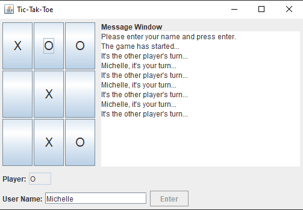

# tic-tac-toe
Multi-player client server tic tac toe with a GUI

### Description:

* Client-server architecture
* Supports multiple games of two clients (implements a thread pool) playing simultaneously
* MVC design pattern
* Object serialization for communication between the server and clients
* Swing based GUI
* Created as part of a lab exercise for ENSF 607 course

### Screenshots:

Player X:

Player O:

